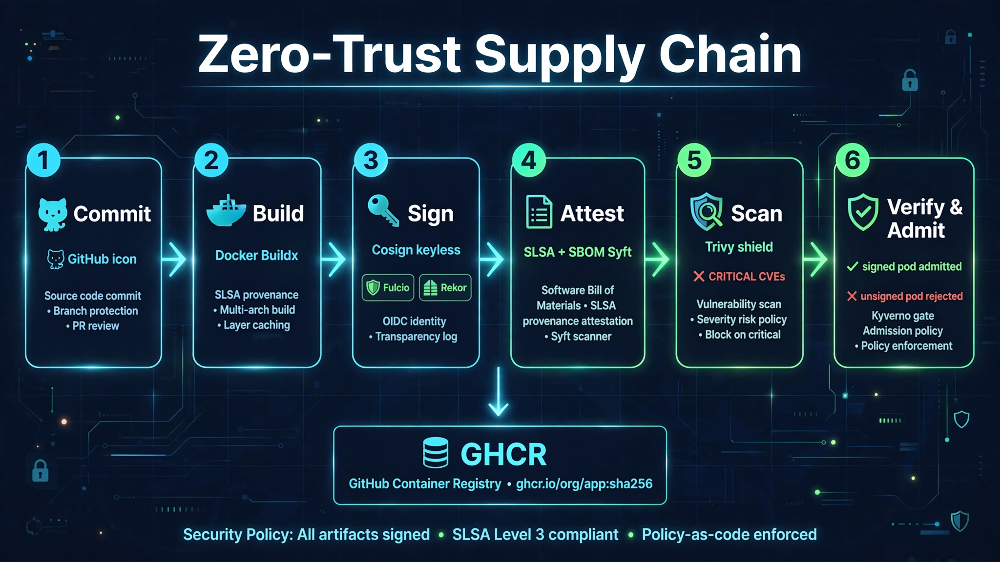
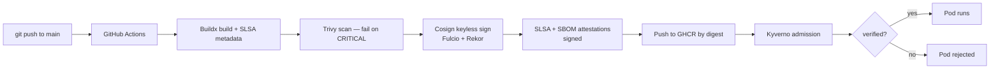

# Zero-Trust Supply Chain 🛡️

[](https://github.com/nourhb/zero-trust-supply-chain/actions/workflows/supply-chain.yaml)
[](https://www.sigstore.dev/)
[](https://slsa.dev/)
[](https://kyverno.io/)
[](LICENSE)

A complete, working **zero-trust software supply chain** for containers:
every image is **built → scanned → signed (keyless) → attested (SLSA + SBOM)**,
and the Kubernetes cluster **re-verifies everything at admission time**
before a single Pod is allowed to run.



## Why zero-trust supply chain?

SolarWinds, Codecov, and countless registry compromises taught the same
lesson: if your cluster runs whatever image a tag points to, you don't have
a supply chain — you have a hope chain. This project replaces hope with
cryptography:


- **No long-lived keys.** Signing is keyless: Fulcio issues short-lived
  certificates from GitHub OIDC identity, and every signature is logged in
  the Rekor transparency log.
- **Provenance, not just signatures.** A signature says *who* signed; SLSA
  provenance says *how it was built* — repo, commit, builder. Both are
  verified.
- **Admission-time enforcement.** Kyverno rejects unsigned, unattested, or
  mutable-tag images at the API server. The cluster trusts nothing.

## Architecture



## Quickstart — local demo in 5 steps

```bash
# 1. Clone
git clone https://github.com/nourhb/zero-trust-supply-chain.git
cd zero-trust-supply-chain

# 2. Spin up Kind + Kyverno + policies (needs: docker, kind, kubectl, helm)
./scripts/setup-kind.sh

# 3. Watch an unsigned image get REJECTED (happens automatically in step 2)

# 4. After a real pipeline run, verify any image manually:
./scripts/verify.sh ghcr.io/nourhb/zero-trust-supply-chain/demo-app@sha256:<digest>

# 5. Tear down
kind delete cluster --name zero-trust-demo
```

See [`docs/`](docs/) for the threat model, keyless signing explainer, and
manual verification guide.

## Pipeline stages

| Stage | Tool | What it guarantees |
|-------|------|--------------------|
| Build | Docker Buildx | Reproducible build with SLSA provenance metadata |
| Scan | Trivy | No known CRITICAL/HIGH CVEs ship (SARIF uploaded) |
| Sign | Cosign (keyless) | Image bound to CI identity; logged in Rekor |
| Attest SLSA | `actions/attest-build-provenance` | Build provenance signed by CI identity |
| Attest SBOM | Syft + Cosign | Signed SPDX dependency list bound to digest |
| Verify | Cosign | Pipeline re-verifies its own artifacts (defense in depth) |
| Admit | Kyverno | Cluster verifies signature + provenance + digest pin |

## Security guarantees

1. Only images signed by this repo's `main`-branch workflow can run.
2. Only images with SLSA provenance from GitHub-hosted runners of this repo can run.
3. Only digest-pinned image references are accepted (`:latest` and mutable tags rejected — including ephemeral containers).
4. No signing keys exist to steal (keyless Fulcio + Rekor).
5. Every signature is publicly auditable in the Rekor transparency log.
6. Workloads run hardened: non-root, read-only filesystem, dropped capabilities, seccomp, resource limits.

## Project structure

```
zero-trust-supply-chain/
├── app/                        # Demo Express microservice + hardened Dockerfile
├── .github/workflows/
│   └── supply-chain.yaml       # Build → scan → sign → attest → verify pipeline
├── kyverno/
│   ├── require-signed-images.yaml    # Enforce keyless Cosign signatures
│   ├── require-slsa-provenance.yaml  # Enforce SLSA build provenance
│   └── disallow-latest-tag.yaml      # Enforce digest pinning
├── kubernetes/
│   ├── namespace.yaml
│   └── deployment.yaml         # Digest-pinned, hardened demo deployment
├── scripts/
│   ├── verify.sh               # Manual cosign verification of any digest
│   └── setup-kind.sh           # Local Kind demo: blocked vs allowed
├── docs/
│   ├── threat-model.md          # STRIDE threat → mitigation matrix
│   ├── how-it-works.md         # End-to-end flow + keyless explainer
│   └── verification.md         # Manual cosign verification guide
├── LICENSE
└── README.md
```

## Author

**Nour El Houda Bouajila** — Cloud/DevOps Engineer, Hamilton, Canada.

- GitHub: https://github.com/nourhb
- Portfolio: https://nour-portfolio-v2.vercel.app

## License

MIT — see [LICENSE](LICENSE).
