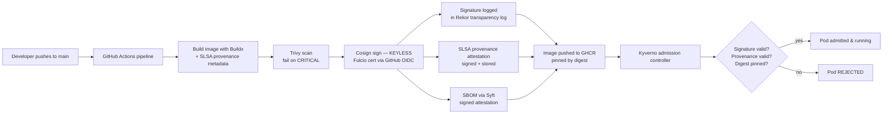

# How It Works

**Author:** Nour El Houda Bouajila (https://github.com/nourhb)

## The idea in one paragraph

In a zero-trust supply chain, **no artifact is trusted because of where it
came from** — every image must *prove* it was built by the right pipeline
from the right source, and the cluster checks that proof every single time
before running anything. This project implements the full loop:
**build → sign → attest → verify → admit**.

## End-to-end flow



## Keyless signing, explained

Traditional image signing needs a private key — which then needs secure
storage, rotation, and access control. Lose the key and attackers can sign
anything as you. **Keyless signing removes the key entirely:**

1. **GitHub OIDC** — When the workflow runs, GitHub mints a short-lived OIDC
   token asserting *exactly* which repo, workflow, and ref is running.
   The workflow's `permissions: id-token: write` enables this; nothing else
   in the repo can mint that identity.

2. **Fulcio** — Sigstore's certificate authority. Cosign presents the OIDC
   token; Fulcio verifies it with GitHub and issues a **short-lived
   certificate** (valid ~20 minutes) binding the workload identity
   (e.g. `https://github.com/nourhb/zero-trust-supply-chain/.github/workflows/supply-chain.yaml@refs/heads/main`)
   to the signature. There is no private key to steal — only an ephemeral
   keypair generated in memory for one signing operation.

3. **Rekor** — the transparency log. Every signature is recorded publicly.
   Verification requires the signature to be present in Rekor, so even a
   compromised Fulcio cannot silently issue rogue signatures — the log
   would show them.

Verification (by you, or by Kyverno at admission) checks three things:
the certificate chains to the Fulcio root, the OIDC subject/issuer match
the expected CI identity, and the signature exists in Rekor.

## What each component does

| Component | File | Role |
|-----------|------|------|
| Pipeline | `.github/workflows/supply-chain.yaml` | Builds, scans, signs, attests — the *producer* of trust |
| Signature policy | `kyverno/require-signed-images.yaml` | Rejects Pods whose images lack a valid keyless signature from our CI |
| Provenance policy | `kyverno/require-slsa-provenance.yaml` | Rejects images without SLSA provenance from GitHub-hosted runners of this repo |
| Digest policy | `kyverno/disallow-mutable-tags.yaml` | Rejects any image reference not pinned by `sha256` digest |
| Demo workload | `kubernetes/` | Shows the correct pattern: digest-pinned, hardened Pod spec |
| Verification | `scripts/verify.sh` | Manual `cosign verify` of signature + attestations for any digest |
| Local demo | `scripts/setup-kind.sh` | Kind + Kyverno + policies; shows blocked vs allowed deployments |

## Rotating the Fulcio certificate

The Kyverno policies embed the Fulcio root chain (fetched from
`https://fulcio.sigstore.dev/api/v1/rootCert`). If Sigstore rotates its PKI:

```bash
curl -s https://fulcio.sigstore.dev/api/v1/rootCert -o /tmp/fulcio-root.pem
# Paste the new chain into the certificateChain blocks in kyverno/
kubectl apply -f kyverno/
```
